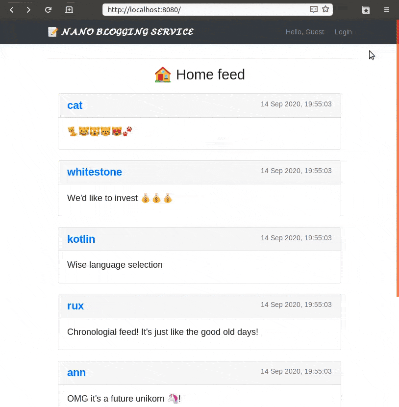

# Nano Blogging Service (Ktor + Okta)

---------------------

This example app demonstrates how to build a simple blogging service with Kotlin, Ktor, kotlinx.html and Okta.



**Prerequisites**

- [Java 11+](https://adoptopenjdk.net/) installed
- [Okta Developer Account](https://developer.okta.com/) created

## Getting Started

* Clone repository:
    ```bash
    $ git clone https://github.com/ruXlab/okta-ktor-nano-blogging-service
    $ cd okta-ktor-nano-blogging-service 
    ```
* Run it!
    ```bash
    $ ./gradlew run    
     ```           
* Head to [localhost:8080](http://localhost:8080) to check application running


## Help

Visit our [Okta Developer Forums](https://devforum.okta.com/). You can also email [developers@okta.com](mailto:developers@okta.com) if would like to create a support ticket.

## License

Apache 2.0, see [LICENSE](LICENSE).